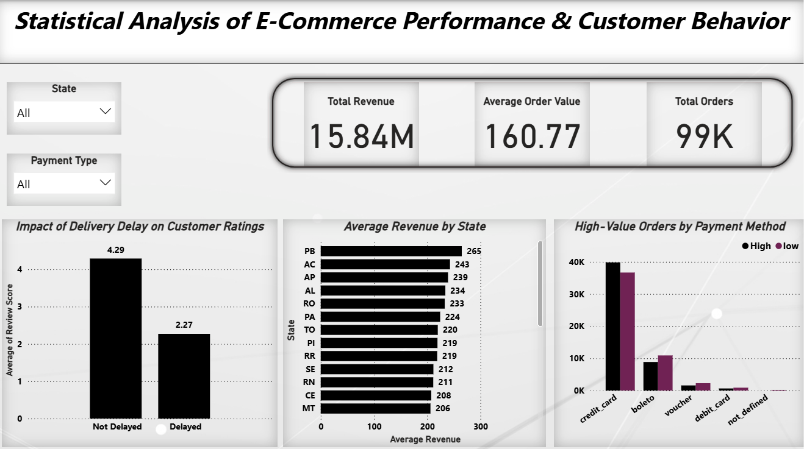

# Statistical-Analysis-of-E-Commerce-Performance-Customer-Behavior

**Project Overview:**

This project presents an end-to-end data analysis pipeline on an e-commerce dataset, combining Python-based statistical analysis with a Power BI dashboard for business insights.
The objective is to identify key drivers of revenue, customer satisfaction, and purchasing behavior using statistically validated methods.

**Business Objectives:**

Analyze revenue trends and order behavior
Evaluate impact of delivery delays on customer satisfaction
Identify regional performance differences
Understand payment method influence on order value

**Tech Stack**
Python: Pandas, NumPy, SciPy
Statistical Methods: t-test, ANOVA, Chi-square
Visualization: Power BI

**Dataset:**

~100K orders dataset (Olist e-commerce)

**Multiple tables:**

Orders (order-level data)
Order Items (product-level data)
Payments (transaction-level data)
Reviews (customer feedback)

 **Data Processing:**
 
Merged multiple datasets using order_id and customer_id
Created key features:
Revenue = price + freight_value
Delivery delay indicator
Order value (aggregated at order level)
Handled data granularity issues (item-level → order-level aggregation)

 **Statistical Analysis:**
 
1. **t-test** (Operational Insight)
Compared review scores for delayed vs non-delayed orders
Result:
Significant drop in ratings for delayed deliveries
(p-value ≈ 0)
Business Insight: Delivery delays strongly impact customer satisfaction

3. **ANOVA** (Regional Analysis)
Compared average revenue across top states
Result:
Significant variation across regions
(p-value < 0.05)
Business Insight: Geographic segmentation affects revenue performance

5. **Chi-Square Test** (Customer Behavior)
Tested relationship between payment method and order value (High vs Low)
Result:
Strong dependency observed
(p-value ≈ 4e-108)
Business Insight: Payment methods influence spending behavior

**Power BI Dashboard:**

The dashboard provides an interactive, one-page business view including:

KPIs:
Total Revenue: 15.8M
Average Order Value: 160
Total Orders: 99K
Key Visuals:
Impact of delivery delay on ratings
Average revenue by state
High-value orders by payment method

**Key Insights:**

- Delayed deliveries reduce customer ratings significantly

- Revenue varies across regions, indicating market differences

- Credit card payments dominate high-value transactions

- Customer behavior is statistically dependent on payment methods

 **Conclusion**

This project demonstrates how statistical analysis enhances business decision-making by validating insights rather than relying on visual trends alone.
The integration of Python and Power BI enables both deep analysis and effective communication.
